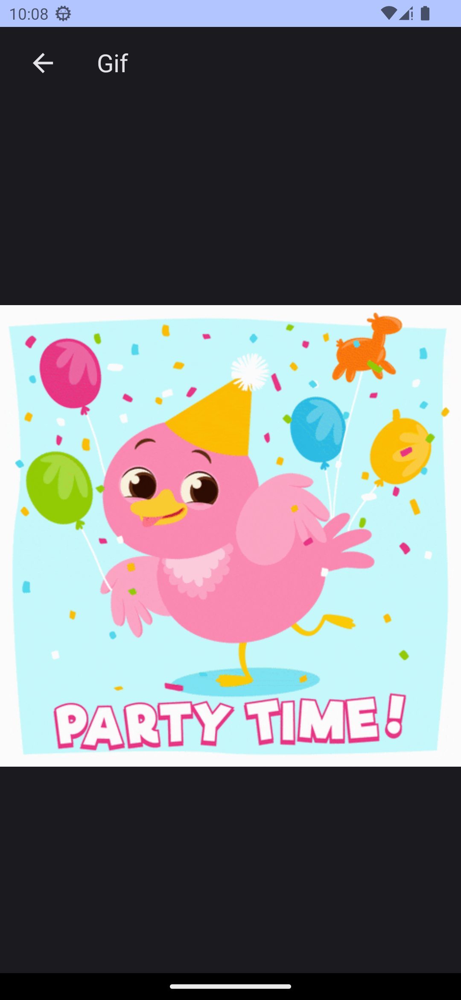
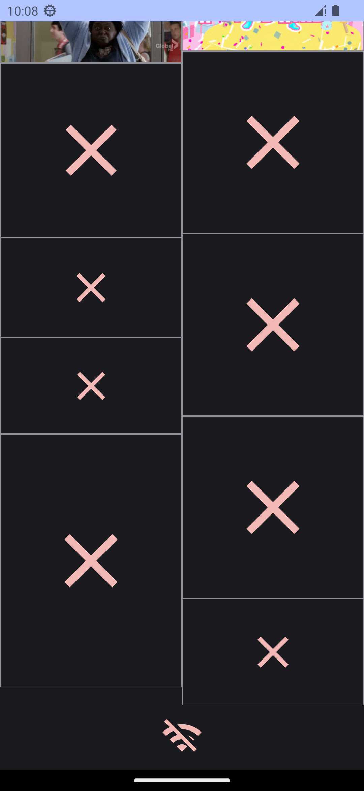

# Тестове завдання Trainee Android

Необхідно створити додаток з використанням giphy REST api https://developers.giphy.com

#### Додаток повинен складатись з двох екранів

- Функціонал першого екрану:
  Відображення gif зображень у вигляді списку/таблиці
- Функціонал другого екрану:
  Повноекранне відображення вибраної гіфки
- Для виконання запитів до API можна скористатися бібліотекою
  Retrofit.
- Головна умова до додатка: запуск з першого разу та коректне
  відпрацювання

### ❗ Для коректної роботи потрібно вписати API_KEY в файлі [gradle.properties](gradle.properties) ❗

## Screenshots

  

